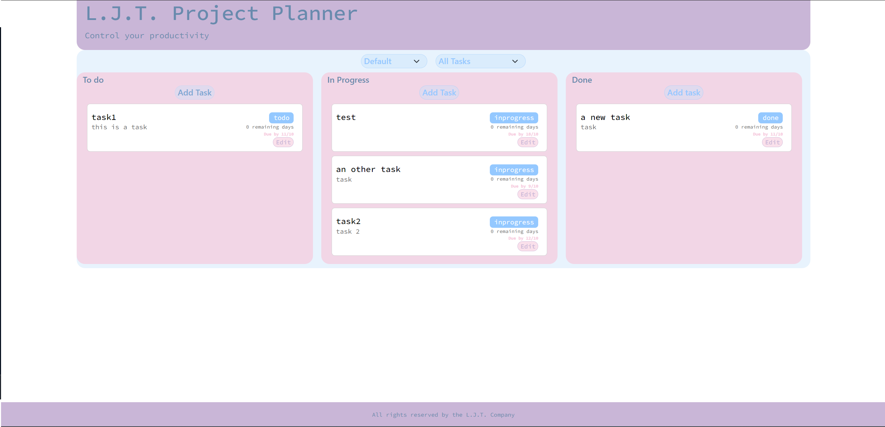

# Project-Planner

Wouldn't it be nice to have a tool to manage our projects? Something that would allow us to track the progression of each requirements of our apps.

This is the list of features we would like to see:

- Allow user to create tasks. Tasks should have a name, a description and a due date
- Allow users to label their tasks with a status (ex: `to do`, `doing`, `done`)
- Display the tasks, with their remaining time. For instance, if today is the 15th of March and the task is due for the 20th of March, display `in 5 days`.
- Allow users to sort their tasks by remainining time, with the most urgent first, or by name.
- Filter tasks (ex: only show "to do" tasks)
- BONUS: Save tasks in LocalStorage, so that they persist even when the page is refreshed.

## Screenshots

## Badges

## work progress

This project was made in October 2023 during a formation at BeCode. 

## Authors

- [@Tom](https://github.com/tomboszko)
- [@Layla](https://github.com/LRI-2020)
- And me

